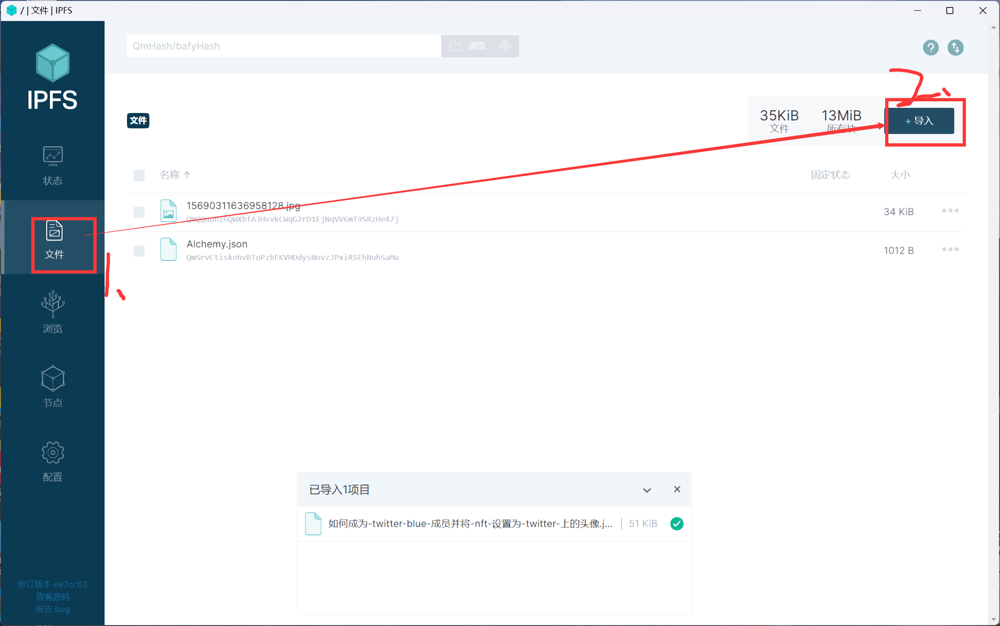
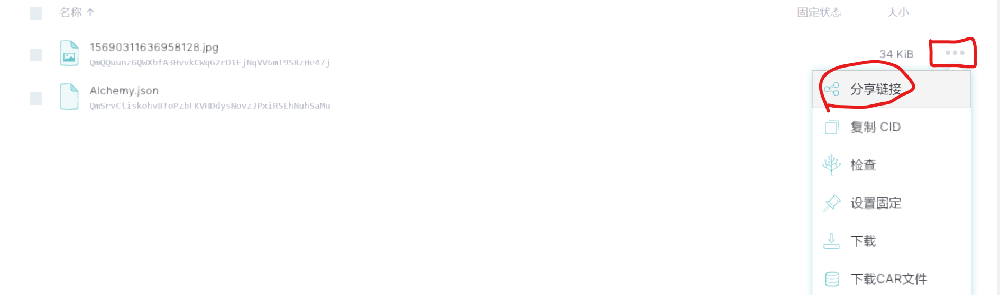
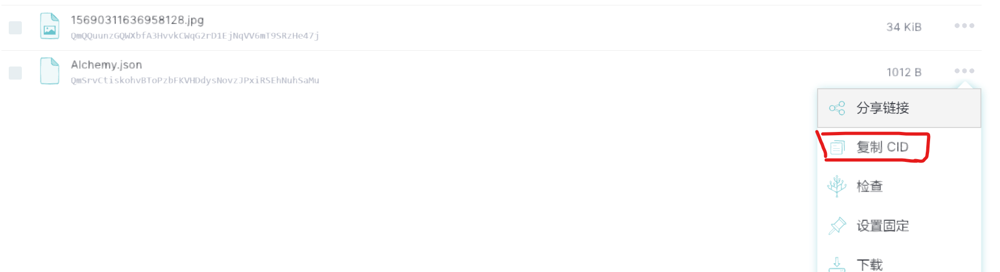
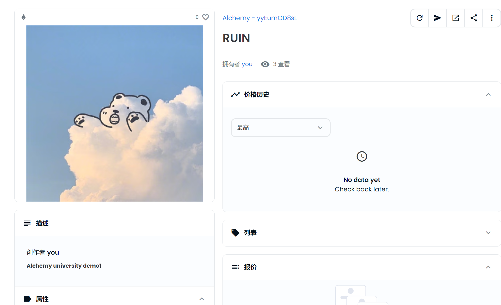

## example01
实例一创建了一个基于ERC-721的NFT合约，该NFT主要使用了openzeppelin库中的合约进行实现
主要内用：
- 1.使用openzeppelin库
- 2.通过hardhat部署ERC-721合约
- 3.使用IPFS进行NFT图片和metadata存储
- 4.在OpenSea上可见

### 1.引用Openzeppelin库
新建一个`.sol`的智能合约文件，合约开始前引入openzeppelin的如下库：
```javascript
import "@openzeppelin/contracts/token/ERC721/ERC721.sol";
import "@openzeppelin/contracts/token/ERC721/extensions/ERC721Enumerable.sol";
import "@openzeppelin/contracts/token/ERC721/extensions/ERC721URIStorage.sol";
import "@openzeppelin/contracts/access/Ownable.sol";
import "@openzeppelin/contracts/utils/Counters.sol";
```
在合约中实现自己想要的方法即可，如需要了解更多ERC-721合约和openzeppelin所提供的方法，请访问[https://docs.openzeppelin.com/contracts/4.x/api/token/erc721](https://docs.openzeppelin.com/contracts/4.x/api/token/erc721)

### 2.使用hardhat编译和部署智能合约
在这个项目中，我使用了`hardhat-deploy`插件进行智能合约的部署，所以需要安装`hardhat-deploy`和`hardhat-deploy-ethers`两个插件：
```shell
yarn add -D hardhat-deploy hardhat-deploy-ethers
```
*具体配置见[README](../../README.md)*
合约编写完成后，使用命令进行编译：
```shell
yarn hardhat compile
```
合约编写完成后，通过`hardhat-deploy`插件进行合约部署
```shell
yarn hardhat deploy --network goerli --tags mynft
```
合约部署完成后即可在etherscan上进行查看
### 3.使用IPFS进行NFT图片和metadata存储
下载安装IPFS Desktop(这是IPFS的桌面化程序，可直接连接和上传文件至IPFS)，可访问[http://docs.ipfs.tech.ipns.localhost:8080/install/ipfs-desktop/](http://docs.ipfs.tech.ipns.localhost:8080/install/ipfs-desktop/)自行下载
安装完成后，选择文件-->+导入-->文件-->选择需要上传的图片：

上传图片完成后点击复制分享链接-->点击复制

复制完成图片的IPFS地址后，创建一个存放metadata的`json`文件，并将刚刚复制的图片IPFS路径粘贴到`image`字段中:
```json
{ 
  "description": "### Alchemy university demo1",
  "external_url": "https://docs.openzeppelin.com/contracts/4.x/wizard",
  "image": "https://ipfs.io/ipfs/QmQQuunzGQWXbfA3HvvkCWqG2rD1EjNqVV6mT9SRzHe47j",
  "name": "RUIN", 
  "attributes": [
    {
      "trait_type": "Base", 
      "value": "Starfish"
    }, 
    {
      "trait_type": "Eyes", 
      "value": "Big"
    }, 
    {
      "trait_type": "Mouth", 
      "value": "Surprised"
    }, 
    {
      "trait_type": "Level", 
      "value": 5
    }, 
    {
      "trait_type": "Stamina", 
      "value": 1.4
    }, 
    {
      "trait_type": "Personality", 
      "value": "Sad"
    }, 
    {
      "display_type": "boost_number", 
      "trait_type": "Aqua Power", 
      "value": 40
    }, 
    {
      "display_type": "boost_percentage", 
      "trait_type": "Stamina Increase", 
      "value": 10
    }, 
    {
      "display_type": "number", 
      "trait_type": "Generation", 
      "value": 2
    }]
  }
```
具体各个元数据字段的作用，可在[OpenSea的官方文档中查看](https://docs.opensea.io/docs/metadata-standards)
metadata文件编辑完成后，使用上传图片相同的方法将metadata文件也上传到IPFS上，并复制CID：

复制完CID后，进入`script/example01`目录下，修改`mynft.ts`文件下的`uri`路径，用自己复制的CID将替换掉“复制的CID”这段文字，得到完整的路径，像这样：
```javascript
ipfs://QmSrvCtiskohvBToPzbFKVHDdysNovzJPxiRSEhNuhSaMu
```
到这里，部署ERC-721NFT合约和铸造及绑定相应的图片已经完成，下面就是在OpenSea上进行查看了
### 4.在OpenSea上查看已拥有的NFT
打开[OpenSea测试网](https://testnets.opensea.io/),使用当前部署合约的钱包地址连接到OpenSea，点击个人资料，即可看到已列出的拥有的NFT，点击进入即可看到：

如果看不见图片，点击图片中右上角刷新元数据按钮，由于元数据和图片存储在IPFS上，所以加载较慢，有的加载几个小时才出来
### end。。。。。。