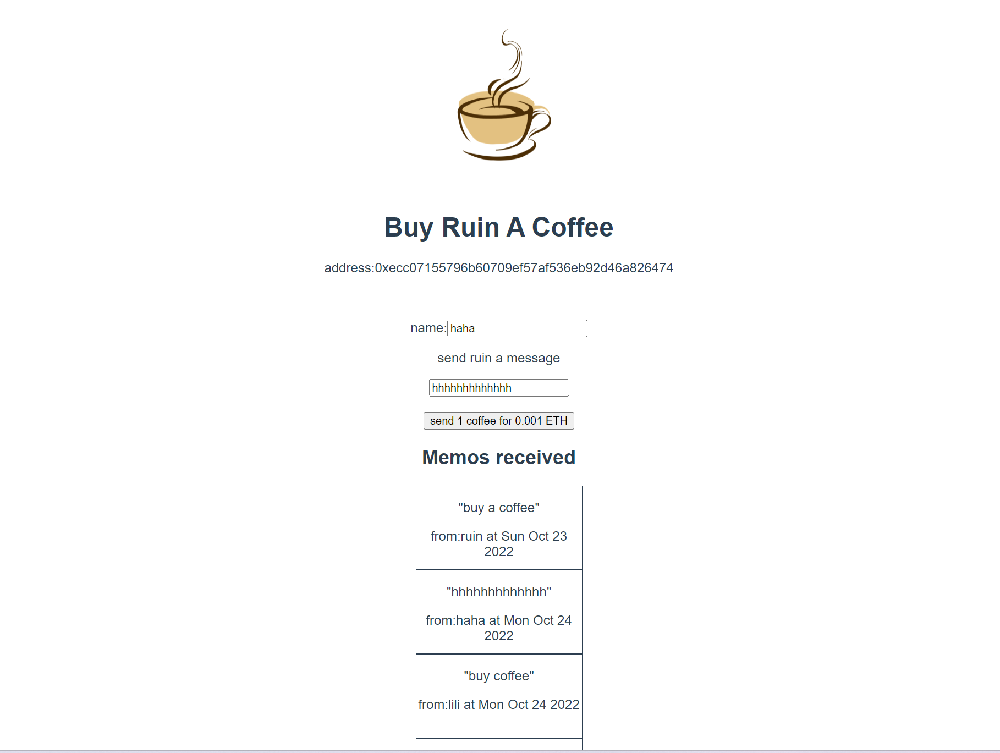

## example02
### 概述
Buy Me A Coffee,基本逻辑：用户输入自己的名字和想要支付的金额（必须大于0），然后点击购买咖啡，将输入的金额对应的ETH发送到合约存储，并记录信息到备忘录列表中，并可查询备忘录列表，最后，合约拥有者可以将合约中的ETH提取到钱包中。
### 步骤一
编写智能合约，[BuyMeACoffee.sol](./BuyMeACoffee.sol)
主要实现思路
- 在部署合约时，`constructor`负责将部署合约的钱包地址存储在`owner`变量中并且`payable`地址，加上了`payable`修饰符后才能转移ETH。
- `buyCoffee`方法是该合约中最重要的方法，需要传递`name`和`message`两个参数，并且是以`payable`修饰符修饰，这样才能转移ether；该方法使用`name`和`message`所传入的参数创建一个`Memo`结构类型的备忘录，并把它存储在链上。
	- 当调用者调用时，由于`require(msg.value > 0, "can't buy coffee for free!");`语句限制了ether的数量必须大于0，所以他们别想提交一些以太币。然后以太币会保留在该合约中，知道被提取。
- `memos Memo`数组包含从`buyCoffee`中购买的所有备忘录结构体信息。
- 每次购买咖啡时会发出`NewMemo`日志事件。这也使得我们能从前端页面中可以获取知道有新的咖啡购买。
- `withdrawTips`是一个任何人都可以调用的方法，但只会向合约的部署者汇款。
	- `address(this).balance`获取存储在合约中的以太币余额。
	- `owner.send(...)`是用ether创建发送交易的方法，向使用`.send`的地址发送以太币，例如该合约中是向`owner`地址发送以太币。
	- `require(...)`语句中包含的所有内容是为了确保如果有问题，事务会被还原且不会丢失任何内容。
有了合约内容，我们就可以开始测试合约的逻辑了
### 合约测试
编写测试脚本[buy-coffee.test.ts](../../test/example02/buy-coffee.test.ts)
测试脚本的主要流程：
1. 获取我们将要使用的账户余额
2. 我们得到需要部署的合约
3. 部署合约
4. 在购买咖啡之前检查余额
5. 购买咖啡
6. 购买之后检查余额
7. 从合约提取ether
8. 取款后查看余额
9. 查看备忘录信息

运行测试脚本：
```shell
yarn hardhat compile
yarn hardhat run test/example02/buy-coffee.test.ts
```
运行结束后会看到如下结果：
```shell
BuyMeACoffee deployed to: 0x5FbDB2315678afecb367f032d93F642f64180aa3
== start ==
Address 0 balance:  9999.9991107175
Address 1 balance:  10000.0
Address 2 balance:  0.0
== bought coffee ==
Address 0 balance:  9999.9991107175
Address 1 balance:  9998.999755257937039576
Address 2 balance:  3.0
== withdrawTips ==
Address 0 balance:  10002.999064873866389506
Address 1 balance:  9998.999755257937039576
Address 2 balance:  0.0
== memos ==
At 1666439844, Carolina (0x70997970C51812dc3A010C7d01b50e0d17dc79C8) said: "You're the best!"
At 1666439845, Vitto (0x3C44CdDdB6a900fa2b585dd299e03d12FA4293BC) said: "Amazing teacher"
At 1666439846, Kay (0x90F79bf6EB2c4f870365E785982E1f101E93b906) said: "I love my Proof of Knowledge"
```
### 合约部署
合约测试完成后，我们就可以将合约部署到链上了，这里部署的是Goerli测试网。
编写部署脚本[buy-coffee.deploy.ts](../../deploy/example02/buy-coffee.deploy.ts);
然后运行脚本进行合约部署：
```shell
yarn hardhat deploy --network goerli --tags buycoffee
```
部署完成之后，控制台会输出部署后的合约地址，你就可以在[https://goerli.etherscan.io/](https://goerli.etherscan.io/)上查看到你的合约了。
合约部署完成后，我们可以写一个脚本用于提取合约中的以太币，[withdraw.ts](../../scripts/example02/withdraw.ts);
运行命令如下：
```shell
yarn hardhat run scripts/example02/withdraw.ts --network goerli
```
执行后如果合约中没有ether，则会输出如下：
```shell
current balance of owner:  0.252548395064118973 ETH
current balance of contract:  0.0 ETH
no funds to withdraw!
current balance of owner:  0.252548395064118973 ETH
```
如果有则会提取到钱包。
有了脚本的帮助，就可以看到具体执行的步骤提示了。
### 前端页面交互
一个完整的Dapp肯定是需要用到前端来进行交互的，但是由于本人前端过于烂，所以就只能写一个很烂的前端来进行演示了。
我用到的前端框架是vue3，具体项目目录在[/client/examle02](../../client/examle02/)，
只需要进入到该路径下运行`yarn serve`命令即可运行前端项目
#### 修改为自己的合约
如果需要修改自己部署的合约，则在[HelloWorld.vue](../../client/examle02/src/components/HelloWorld.vue)文件中第29行修改`buyMeACoffeeAddress`参数变量为自己的合约地址，地址修改完成后还需要把自己合约编译出来的abi替换掉，具体在[nt/examle02/src/types/factories/BuyMeACoffee__factory.ts](../../client/examle02/src/types/factories/BuyMeACoffee__factory.ts)文件下_abi字段。
全部修改完成后运行项目即可。
运行结果如图：

