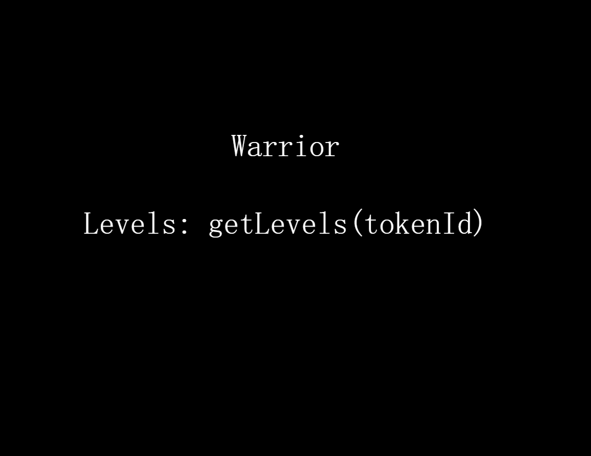
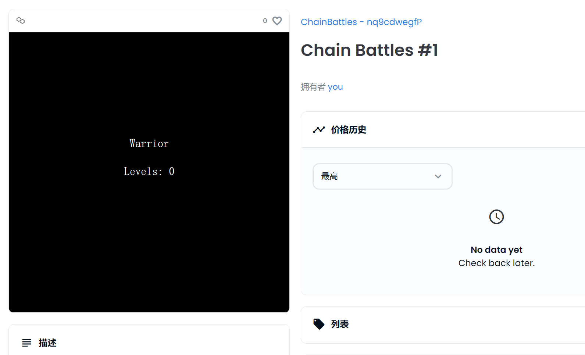
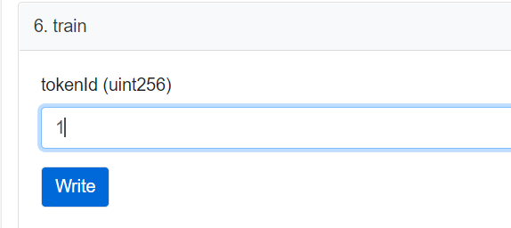
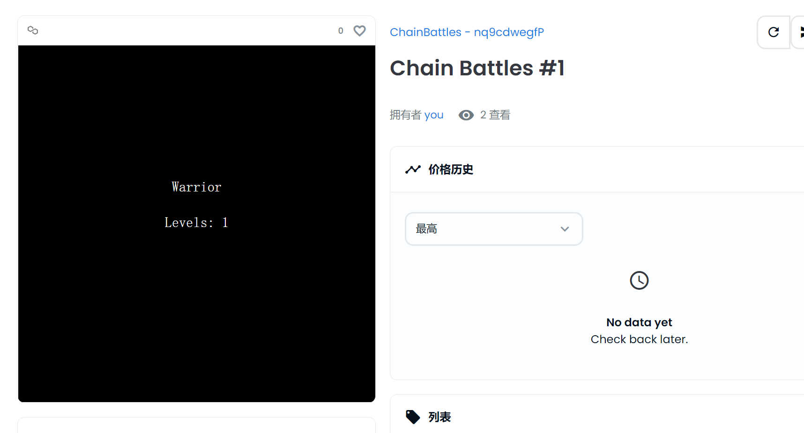

## 概述
这是一个可动态更新元数据的NFT，它的元数据和图片都是存储在链上的，所以这里主要用到了SVG格式的图像
### 为什么需要svg
首先svg是可缩放矢量图形文件，一种标准的图形文件类型；以其他图形格式不同的是，svg格式将图像存储为了矢量，矢量是一种基于数学公式由点、线、曲线和形状组成的图形。
其次，svg是由XML来编写的，XML是一种用于存储和传输数字信息的标记语言。svg文件中的XML代码指定了构成图像的所有形状、颜色和文本。
最后
- svg可以通过代码进行修改和生成；
- 可以转换为base64数据

例如，将如下数据复制到浏览器中即可生成图形：
```XML
data:image/svg+xml;base64,IDxzdmcgeG1sbnM9Imh0dHA6Ly93d3cudzMub3JnLzIwMDAvc3ZnIiBwcmVzZXJ2ZUFzcGVjdFJhdGlvPSJ4TWluWU1pbiBtZWV0IiB2aWV3Qm94PSIwIDAgMzUwIDM1MCI+CiAgICAgICAgPHN0eWxlPi5iYXNlIHsgZmlsbDogd2hpdGU7IGZvbnQtZmFtaWx5OiBzZXJpZjsgZm9udC1zaXplOiAxNHB4OyB9PC9zdHlsZT4KICAgICAgICA8cmVjdCB3aWR0aD0iMTAwJSIgaGVpZ2h0PSIxMDAlIiBmaWxsPSJibGFjayIgLz4KICAgICAgICA8dGV4dCB4PSI1MCUiIHk9IjQwJSIgY2xhc3M9ImJhc2UiIGRvbWluYW50LWJhc2VsaW5lPSJtaWRkbGUiIHRleHQtYW5jaG9yPSJtaWRkbGUiPldhcnJpb3I8L3RleHQ+CiAgICAgICAgPHRleHQgeD0iNTAlIiB5PSI1MCUiIGNsYXNzPSJiYXNlIiBkb21pbmFudC1iYXNlbGluZT0ibWlkZGxlIiB0ZXh0LWFuY2hvcj0ibWlkZGxlIj5MZXZlbHM6IGdldExldmVscyh0b2tlbklkKTwvdGV4dD4KICAgICAgICA8L3N2Zz4=
```

这样就不需要再将图片单独存储到中心化服务器或IPFS中了
这里的代码可以看出，主要分为两部分：
- 数据指令：告诉浏览器怎么处理数据(data:image/svg+xml;base64,)
- Base64数据：包含base64编码的实际数据

这样solidity就可以进行处理了，只需要将svg的标签和字符串序列转换为base64，然后就可以存储在链上了，从而不需要对象存储。
具体实现可自行查看合约[ChainBattles.sol](ChainBattles.sol)或[区块浏览器](https://mumbai.polygonscan.com/address/0xD6Cf928B37e694807CEa32C3ed733CeE3AB2Ea60#code)进行查看。

该合约我是部署在polygon mumbai测试网上的，部署命令：
```shell
yarn hardhat deploy --network mumbai --tags chainbattle
```
### mint NFT
可在区块浏览器上进行NFT mint，[去mint](https://mumbai.polygonscan.com/address/0xd6cf928b37e694807cea32c3ed733cee3ab2ea60#writeContract)

NFT mint完成后可前往[testnets.opensea.io](https://testnets.opensea.io/)进行查看，在搜索框中搜索NFT 地址即可，我的NFT地址：0xD6Cf928B37e694807CEa32C3ed733CeE3AB2Ea60

初始的NFT如图：

### 更新动态的NFT
回到[区块浏览器](https://mumbai.polygonscan.com/address/0xd6cf928b37e694807cea32c3ed733cee3ab2ea60#writeContract)调用“train”方法，

输入你自己的NFT tokenId，点击Write

交易结束后，回到[testnets.opensea.io](https://testnets.opensea.io/)上刷新即可看到等级已经变成了1：


end......