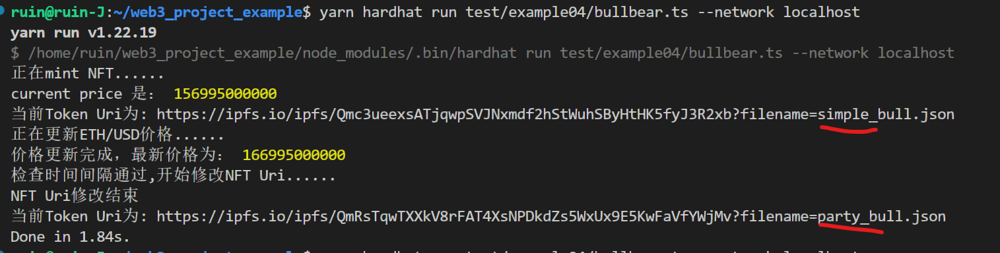

## 动态NFT（dNFT）
目前NFT的基本用力就是数字藏品，例如艺术家铸造数字艺术NFT，收藏家收藏该NFT；一旦NFT被铸造出来，他们的tokenId就不会改变，但是，包含NFT的描述、图像等元数据完全是可选择的。NFT最简单的形式中只是一个具有唯一tokenId的可转让代币。

静态NFT也是当前最常见的NFT类型，包括大多数的NFT艺术品和GameFi中的人物装备以及数字藏品，都是静态的；当然，除了这些用例以外，NFT还可以为现实世界中的物品数字化并提供独特的价值，例如房产契约、专利、身份ID等唯一标识符。

这些静态模型都是固定永久性的，因为他们的元数据一旦在区块链上铸造，就不能改变了；但是一些标记现实世界的用例通常需要更新数据，例如汽车修改颜色、房屋变化等。动态NFT就可以用来解决这方面的问题，使得NFT能够保留其唯一标识符的同时也能够更改其元数据的各个方面。

简单来说，动态NFT就是可以根据外部条件而变化的NFT，动态NFT的变化通常是指由智能合约触发的NFT元数据的变化，这是通过NFT智能合约中编码自动更改来完成的，该智能合约向底层NFT提供有关何时以及如何更改其元数据的指令。

## 存在问题
如上所述，动态 NFT 元数据更改可以根据外部条件以多种方式触发。这些条件可以存在于链上和链下。然而，区块链本质上无法访问链下数据和计算。

## Chainlink
[Chainlink](https://chain.link)通过提供各种可用作触发 dNFT 更新的输入的链下数据和计算服务来克服这些限制。随着 dNFT 生态系统的扩展和 NFT 与现实世界的紧密集成，Chainlink 充当了两个断开连接的世界之间的桥梁，实现了自动化、去中心化和引人入胜的 dNFT 流程的构建。

## 具体实现
这里即将实现的是利用Chainlink来获取eth/usd的实时价格，从而自动修改NFT图片的一个实例。

1.编写普通NFT合约

根据[example01](../example01/MyNFT.sol)中的介绍，先编写一个NFT智能合约

2.将需要的图片和元数据上传至IPFS,图片及元数据位置：[`/contract/example04/ipfs`](./ipfs/)

3.将元数据的IPFS链接写入合约
```typeScript
    string[] bull_json = [
        "https://ipfs.io/ipfs/Qmc3ueexsATjqwpSVJNxmdf2hStWuhSByHtHK5fyJ3R2xb?filename=simple_bull.json",
        "https://ipfs.io/ipfs/QmRsTqwTXXkV8rFAT4XsNPDkdZs5WxUx9E5KwFaVfYWjMv?filename=party_bull.json",
        "https://ipfs.io/ipfs/QmS1v9jRYvgikKQD6RrssSKiBTBH3szDK6wzRWF4QBvunR?filename=gamer_bull.json"
    ];

    string[] bear_json = [
        "https://ipfs.io/ipfs/QmZVfjuDiUfvxPM7qAvq8Umk3eHyVh7YTbFon973srwFMD?filename=simple_bear.json",
        "https://ipfs.io/ipfs/QmQMqVUHjCAxeFNE9eUxf89H1b7LpdzhvQZ8TXnj4FPuX1?filename=beanie_bear.json",
        "https://ipfs.io/ipfs/QmP2v34MVdoxLSFj1LbGW261fvLcoAsnJWHaBK238hWnHJ?filename=coolio_bear.json"
    ];
```

4.修改`safeMint()`方法

指定默认NFT uri路径，不需要在通过参数传入
```JavaScript
	function safeMint(address to) public onlyOwner {
        uint256 tokenId = _tokenIdCounter.current();
        _tokenIdCounter.increment();
        _safeMint(to, tokenId);
        // 指定默认创建NFT uri
        _setTokenURI(tokenId, bull_json[0]);
    }
```

5.添加条件限制的全局参数
```typescript
	// 跟新的时间间隔
    uint256 public interval;
	// 记录上一次的时间间隔
    uint256 public lastTimeStamp;
	// 当前ETH/USD的价格
    int256 public currentPrice;
```
6.引入并在合约中定义chainlink的喂价合约（chainlink的价格信息合约）
```typescript
import "@chainlink/contracts/src/v0.8/AutomationCompatible.sol";

contract BullBear{
	/*... ...*/
	    AggregatorV3Interface internal priceFeed;
	/*... ...*/
}
```
7.实现获取最新价格的方法,具体可见[chainlink-price-feeds](https://docs.chain.link/docs/data-feeds/price-feeds/)
```typescript
function getLatestPrice() public view returns (int) {
        (
            /*uint80 roundID*/,
            int price,
            /*uint startedAt*/,
            /*uint timeStamp*/,
            /*uint80 answeredInRound*/
        ) = priceFeed.latestRoundData();
        return price;
    }
```
8.在构造函数中加入参数（时间间隔和chainlink喂价合约地址）并赋值
```typescript
    constructor(uint256 _interval,address _priceFeed) ERC721("Bull&Bear", "(^-_-^)&(``O``)") {
        interval = _interval;
        lastTimeStamp = block.timestamp;
        
        priceFeed = AggregatorV3Interface(_priceFeed);
        
        currentPrice = getLatestPrice();
    }
```
9.下面开始使用chainlink实现自动化执行，首先引入`AutomationCompatible.sol`合于并继承`AutomationCompatibleInterface`。

10.继承完成后需要实现`checkUpkeep()`和`performUpkeep()`两个方法，具体可见[chainlink-automation](https://docs.chain.link/docs/chainlink-automation/compatible-contracts/)
```typescript
    function checkUpkeep(bytes calldata /* checkData */) external view override returns (bool upkeepNeeded, bytes memory /* performData */) {
        
    }

    function performUpkeep(bytes calldata /* performData */) external override {
        
    }
```
`checkUpKeep()`是chainlink注册用于检测是否达到设置条件的方法，`performUpkeep()`是chainlink用于执行逻辑的方法
11.具体实现`checkUpkeep()`和`performUpkeep()`两个方法的方法体逻辑
```typescript
function checkUpkeep(bytes calldata /* checkData */) external view override returns (bool upkeepNeeded, bytes memory /* performData */) {
        upkeepNeeded = (block.timestamp - lastTimeStamp) > interval;
    }

    function performUpkeep(bytes calldata /* performData */) external override {
        if((block.timestamp - lastTimeStamp) > interval){
            int latestPrice = getLatestPrice();
			// 如果价格不变则什么都不执行
            if(latestPrice == currentPrice){
                return;
            }else if(latestPrice > currentPrice){// 如果大于上一次的价格，则改变uri为牛(true)
                updateAllTokenUris(true);
            }else{//否则为熊(false)
                updateAllTokenUris(false);
            }
			currentPrice = latestPrice;
        }
    }
```
12.实现`updateAllTokenUris()`方法
由`performUpkeep()`方法传入的参数实现，`true`为bull(牛)，`false`为bear(熊):
```typescript
	event TokensUpdate(string);
	/**
     * @param bullOrBear true:Bull，false:bear
     */
    function updateAllTokenUris(bool bullOrBear) internal {
        // 获取当前tokenId，及发行NFT数量
        uint256 currentTokenId = _tokenIdCounter.current();
        string memory uri_json;
        if (bullOrBear) {
            uri_json = bull_json[1];
            emit TokensUpdate("bull");
        } else {
            uri_json = bear_json[1];
            emit TokensUpdate("bear");
        }
        for (uint256 i = 0; i < currentTokenId; i++) {
            _setTokenURI(i, uri_json);
        }
    }
```
到这里，这个动态NFT合约的基本功能已经实现完成了。
## 合约测试
这里使用了chainlink库里面的[`MockV3Aggregator.sol`](./MockPriceFeed.sol)合约进行PriceFeed测试
测试结果：
